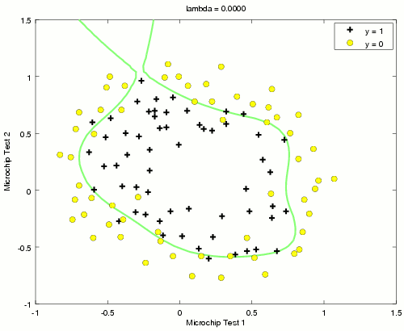
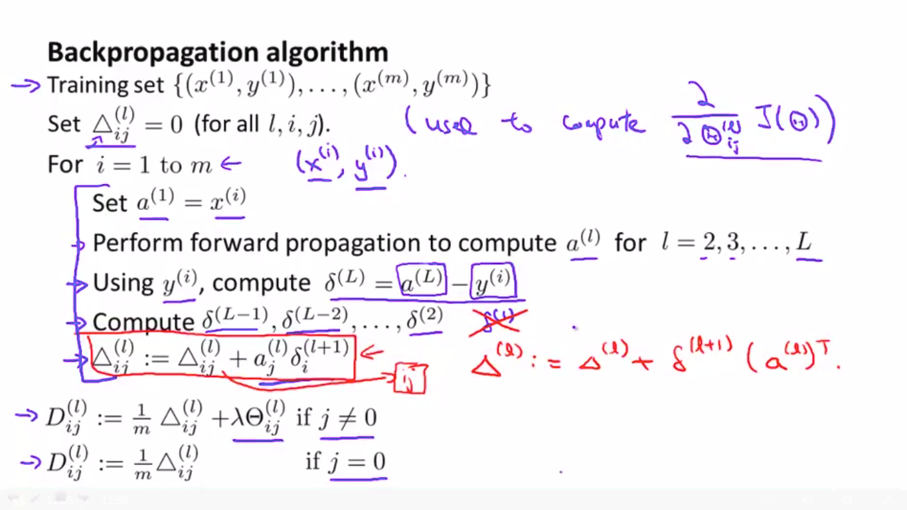
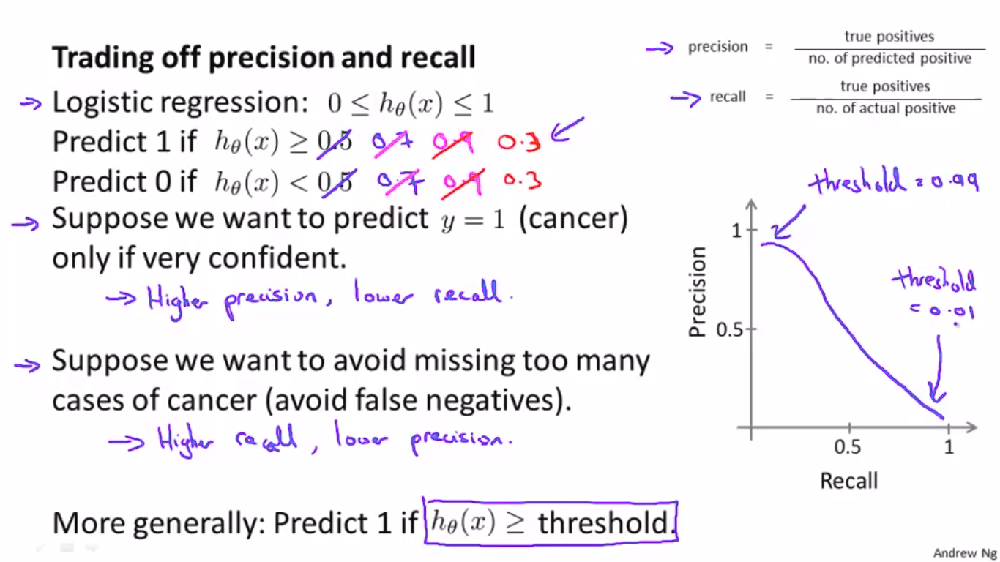

## Coursera Machine Learning -- by Andrew Ng
The code here is my exercise answers

#### WEEK 2 Linear Regression

#### WEEK 3 Classification Logistic Regression

#### WEEK 4 Neural Networks: Representation

#### WEEK 4 Neural Networks: Learning

#### WEEK 5 Evaluating a Learning Algorithm | Bias vs. Variance

 