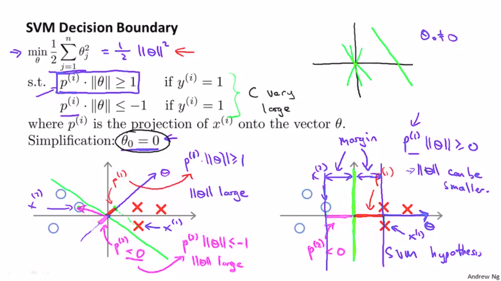
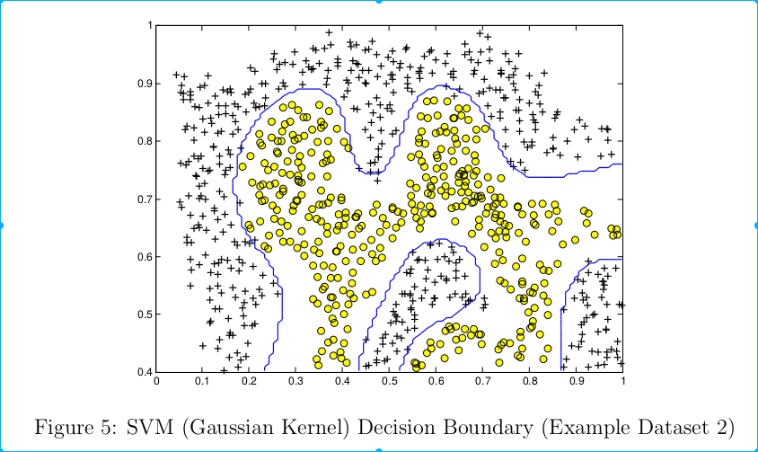
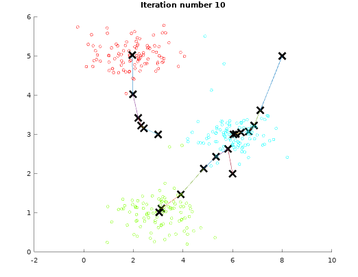

## Coursera Machine Learning -- by Andrew Ng
The code here is my exercise answers

#### WEEK 1 Introduction

#### WEEK 2 Linear Regression

#### WEEK 3 Classification Logistic Regression

		
	
Lambda Animation

#### WEEK 4 Neural Networks: Representation

			
	
XNOR

#### WEEK 4 Neural Networks: Learning

	
	
Backpropagation
	

#### WEEK 5 Evaluating a Learning Algorithm | Bias vs. Variance

		
	
Precision and Recall | Bias and Variance

 
#### WEEK 6 Support Vector Machines | Kernels | Spam Classification

		
	
SVM Large Margin

		
	
SVM Gaussian Kernel

### WEEK 7 K-means Clustering and Principal Component Analysis

		
	
K-means Clustering

